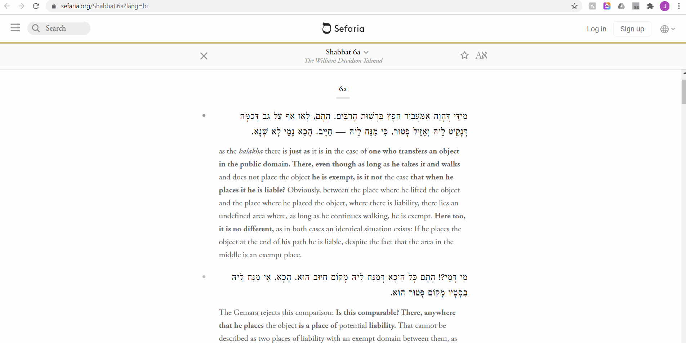

# **I'm Learning Lucky** | Google Chrome Extension
*A project for Sefaria Hackathon, Summer 2020*

## About
#### **Concept**
This project is a Chrome browser extension for sefaria.org, that utilizes the [Sefaria API](https://github.com/Sefaria/Sefaria-Project/wiki/API-Documentation#sefaria-apis) to raise fun insights while studying a text on the platform.
- The first feature, called 'Jastrow Jackpot,' allows the user to search a Hebrew/Aramaic word in the Jastrow Aramaic Dictionary, and receive not only the relevant definitions, but also a special message if the user has stumbled upon a 'Jastrow Jackpot' - when an example of the word's usage that the dictionary references matches the source currently being learned (in this case, the source one has open in sefaria.org). 
- The second feature, called 'Timely Texts,' allows the user to check if the text they currently have open is linked to any of the 'Timely Texts,' i.e. the texts that relate to the current calendar date (e.g. the Daf Yomi of that day, or the Parashat Hashavua of that week). It is only present in version 3 (v3). 

#### **Versions**
There are three versions of the extension. Version 1 (v1) is more 'raw' but also slightly faster. Version 2 (v2) has a nicer look but takes a bit longer to render. Version 3 (v3) is essentially identical to v2, with the addition of the 'Timely Texts' feature.

## How to install
To install the extension, open a Chrome browser and go to chrome://extensions/ and click on 'Load unpacked'. For the folder, choose the appropriate folder from this repository, e.g. v1/chrome_extension

## How to use (Jastrow Jackpot)
Go to the [sefaria website](https://www.sefaria.org/texts) and open a text (for example, [this passage](https://www.sefaria.org/Shabbat.6a?lang=bi) in Tractate Shabbat). Then open the extension:

### *Version 1 Interface*
Type in the hebrew word you wish to search, and click 'Search'. You should see the Jastrow Dictionary definitions relevant to your query, along with functional links to Sefaria pages. If you are lucky enough, you might just stumble upon a 'Jastrow Jackpot':

### *Version 2 Interface*
In this version, the search result will appear as an iframe of Sefaria's website:

## How to use (Timely Texts)
With the extension open, click on 'Check Timely Texts' to see if the source currently open is related to any 'Timely Texts.' After the results appear, click 'Clear Timely Texts results' to restart.

